# Risotto - Discover Your Next Favorite Meal

<div align="center">
  
  
  
  
</div>

## 🍲 About

**Risotto** is a premium recipe discovery application designed for modern food enthusiasts. Built with a focus on simplicity and powerful features, it allows users to explore thousands of recipes, watch video tutorials, and save their favorites for offline access. The app combines the best of Android development practices with a stunning interactive UI.

## ✨ Features

- 🔑 **Secure Authentication** - Sign in using Email/Password or one-tap Google Sign-In via Firebase.
- 🥘 **Discover Recipes** - Explore diverse categories from around the globe (Seafood, Vegetarian, Desserts, etc.).
- 🔍 **Smart Search** - Fast, debounced search results with a curated "Top Meals" grid for initial discovery.
- 📺 **Interactive Tutorials** - Watch embedded YouTube cooking guides directly within the meal details.
- 💖 **Offline Favorites** - Save recipes to your local vault. View full meal details, ingredients, and instructions even without an internet connection.
- 🌐 **Fully Localized** - Seamless support for both English and Arabic languages with RTL support.
- 🌓 **Dark Mode Support** - Beautifully crafted themes for comfortable browsing day or night.

## 🛠️ Technologies Used

- **Architecture**: MVP (Model-View-Presenter) with Repository Pattern.
- **Asynchrony**: [RxJava 3](https://github.com/ReactiveX/RxJava) & RxAndroid for reactive data streams.
- **Network**: [Retrofit 2](https://square.github.io/retrofit/) & OkHttp + [TheMealDB API](https://www.themealdb.com/api.php).
- **Persistence**: [Room Database](https://developer.android.com/training/data-storage/room) for caching and offline favorites.
- **Image Loading**: [Glide](https://github.com/bumptech.glide/glide) with custom transformations.
- **Authentication**: [Firebase Auth](https://firebase.google.com/docs/auth) Integration.
- **Video**: [YouTube Player SDK](https://github.com/PierfrancescoSoffritti/android-youtube-player).
- **Navigation**: [Jetpack Navigation Component](https://developer.android.com/guide/navigation) with Single Activity Architecture.

## 📸 Screenshots

### Splash & Authentication
<p align="center">
  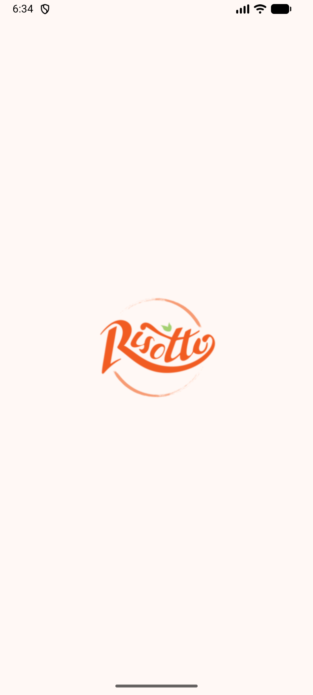
  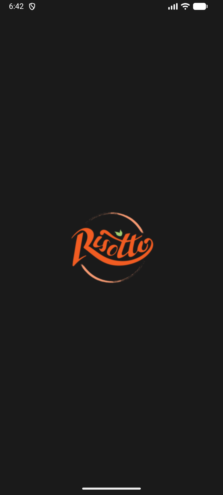
  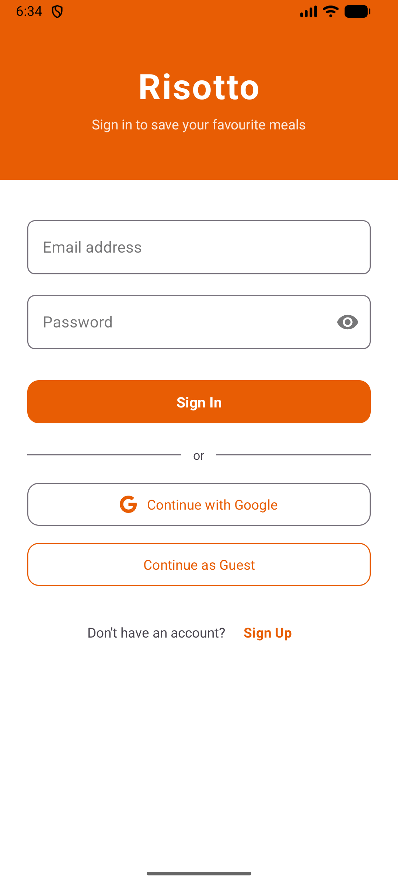
  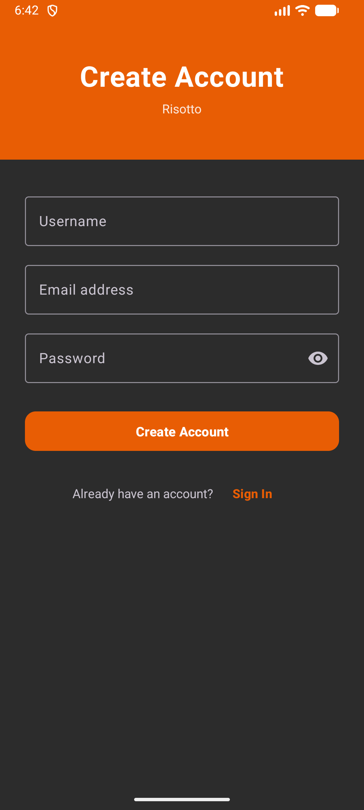
</p>
*Onboarding and Secure Access (Light & Dark)*

### Discover & Categories
<p align="center">
  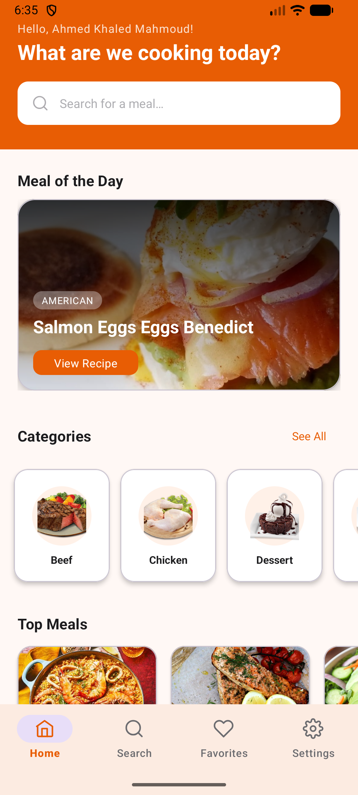
  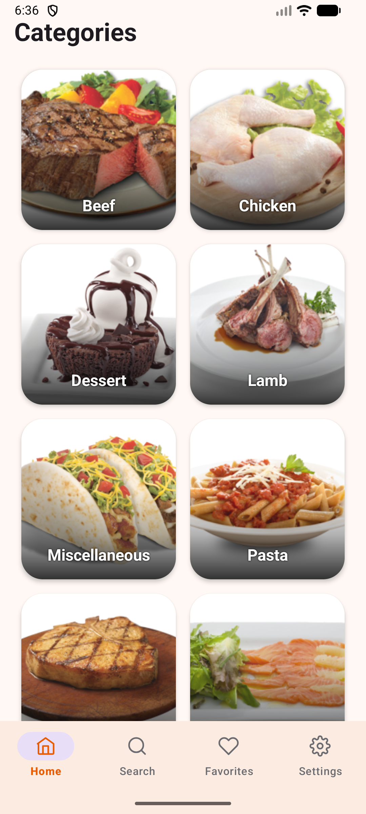
  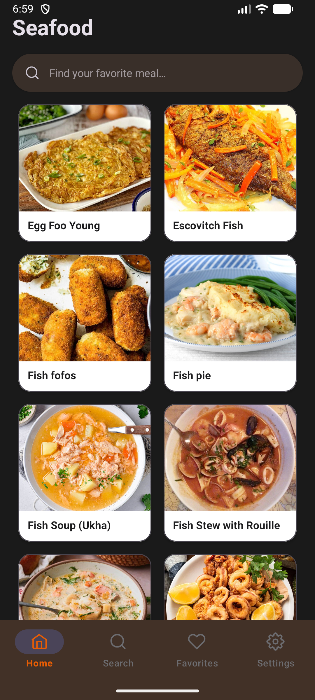
</p>
*Browse Categories and Explore Meal Collections*

### Smart Search Experience
<p align="center">
  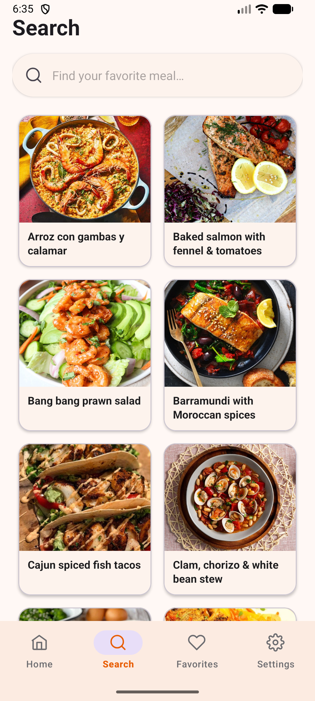
  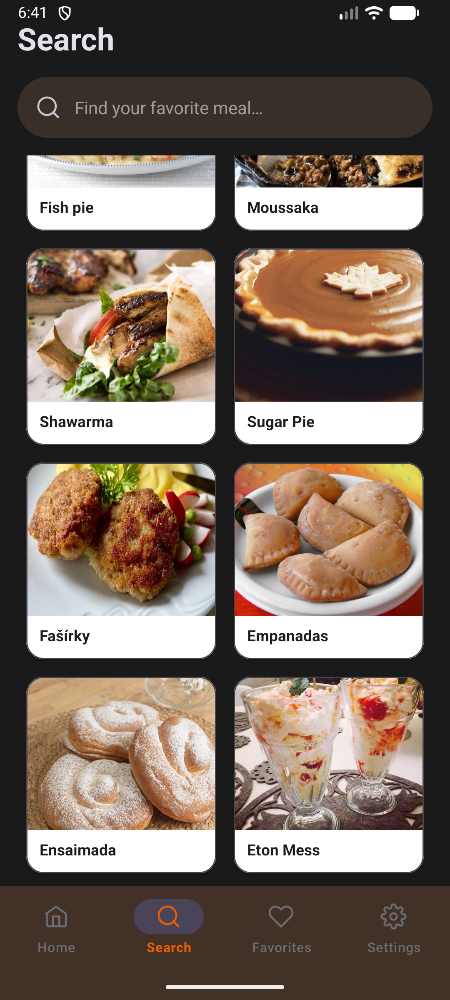
  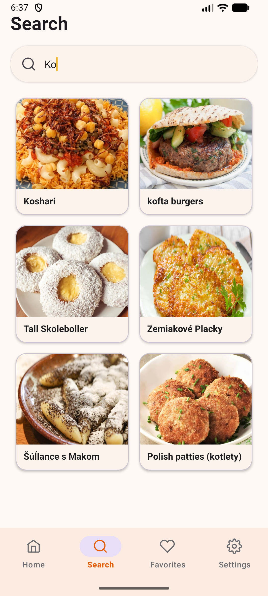
  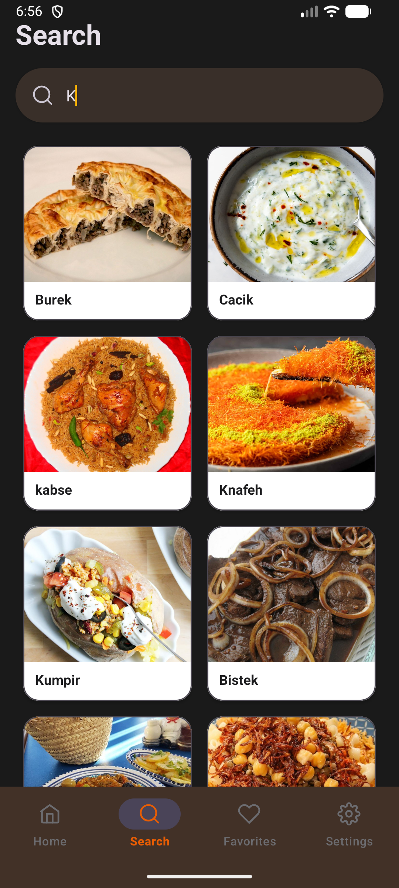
</p>
*Instant Top Meals and Real-Time Search Results*

### Meal Details & Video Tutorials
<p align="center">
  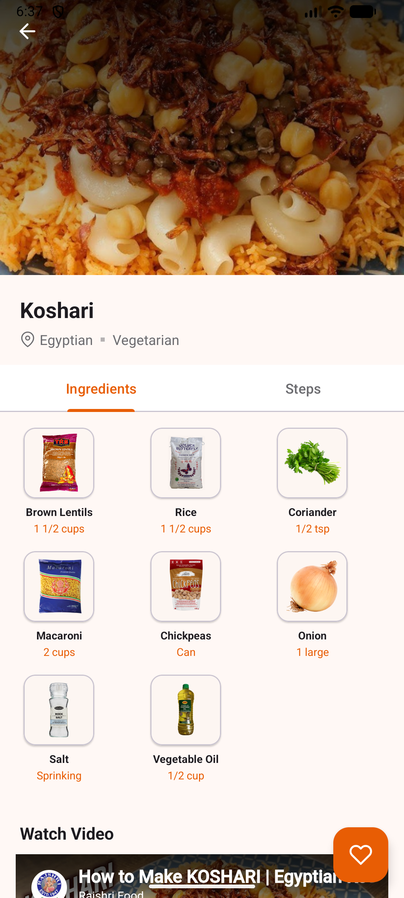
  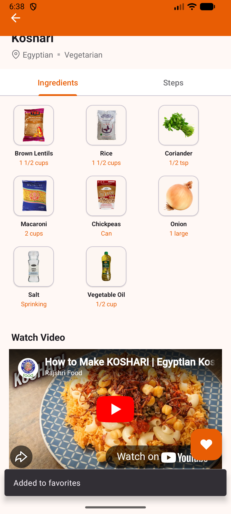
  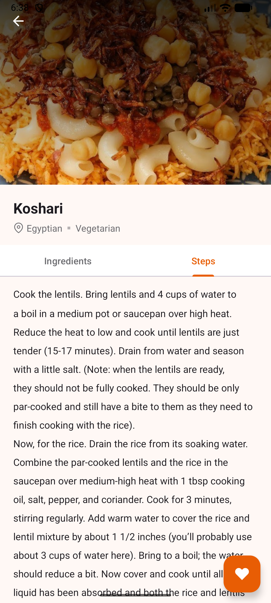
  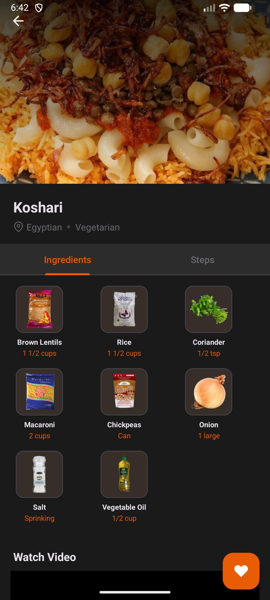
</p>
*Ingredients, Step-by-Step Instructions, and Local Video Support*

### Favorites & Management
<p align="center">
  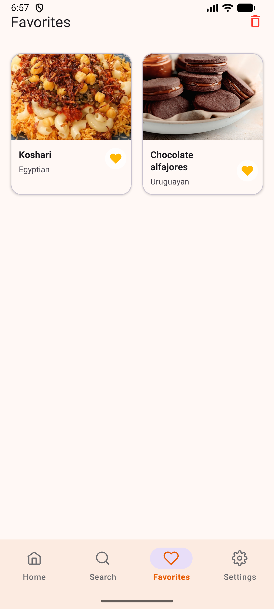
  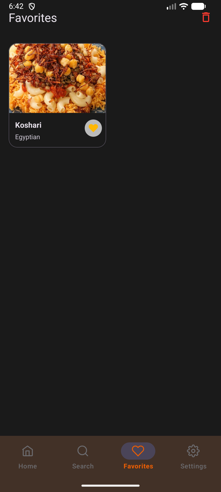
  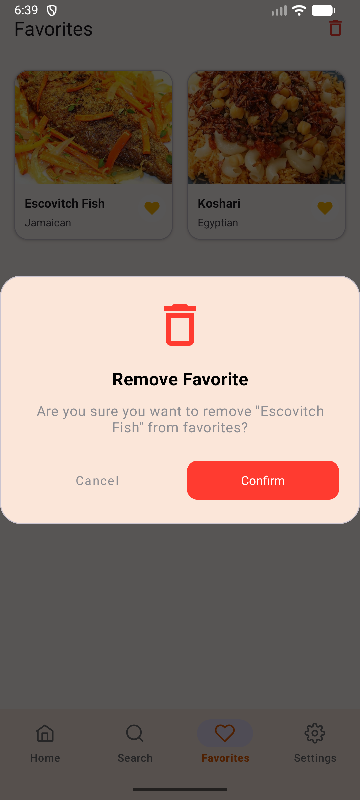
  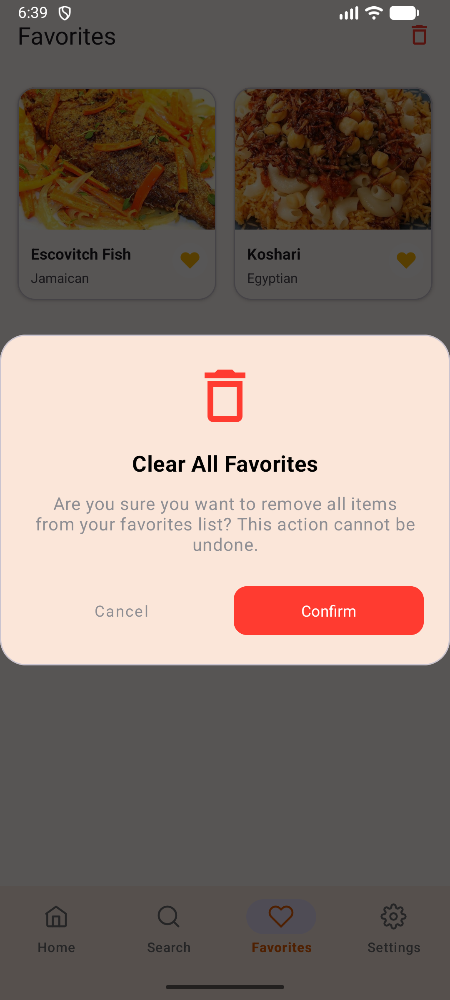
</p>
*Offline Saved Recipes with Easy Management Tools*

### Settings & Localization
<p align="center">
  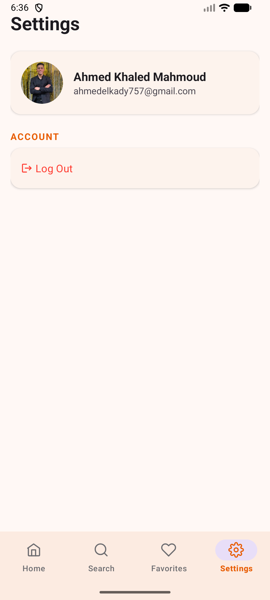
  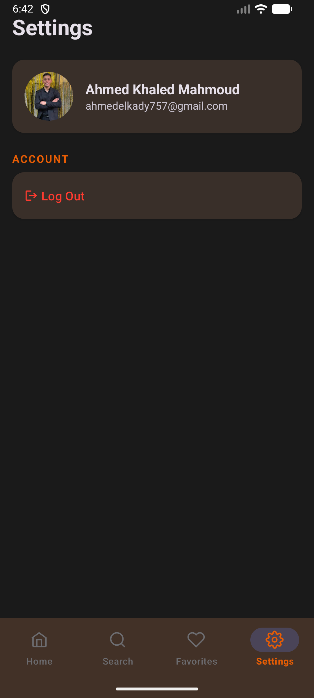
</p>
*Profile Management and Localization Shortcuts*

## 🚀 Getting Started

### Prerequisites

- Android Studio (Ladybug or higher recommended)
- Java Development Kit (JDK) 11
- Android SDK 34+ (Targeting 36)
- An Android device/emulator (API 24+)

### Installation

1. **Clone the repository**
   ```bash
   git clone https://github.com/ahmedelkady757/Risotto.git
   cd Risotto
   ```

2. **Firebase Setup**
   - Add your `google-services.json` to the `app/` directory.
   - Enable Email/Password and Google Sign-In in the Firebase Console.

3. **Build and run**
   - Open in Android Studio.
   - Sync Gradle.
   - Deploy to your device.

## 📄 License

This project is licensed under the MIT License - see the LICENSE file for details.
